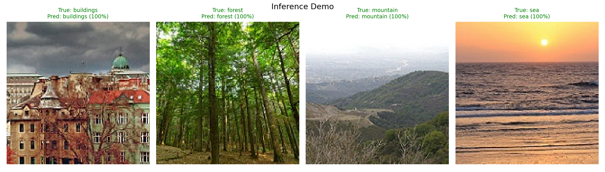
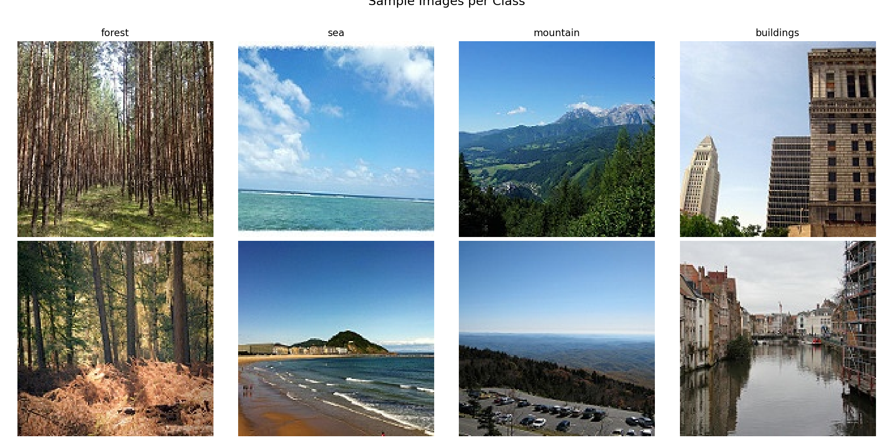
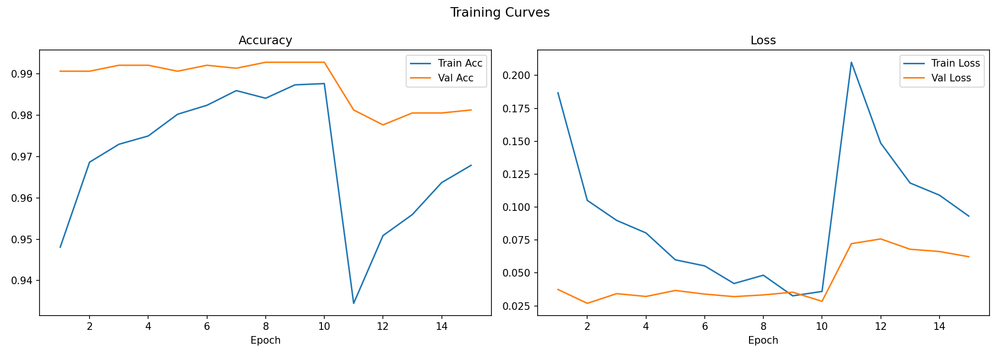
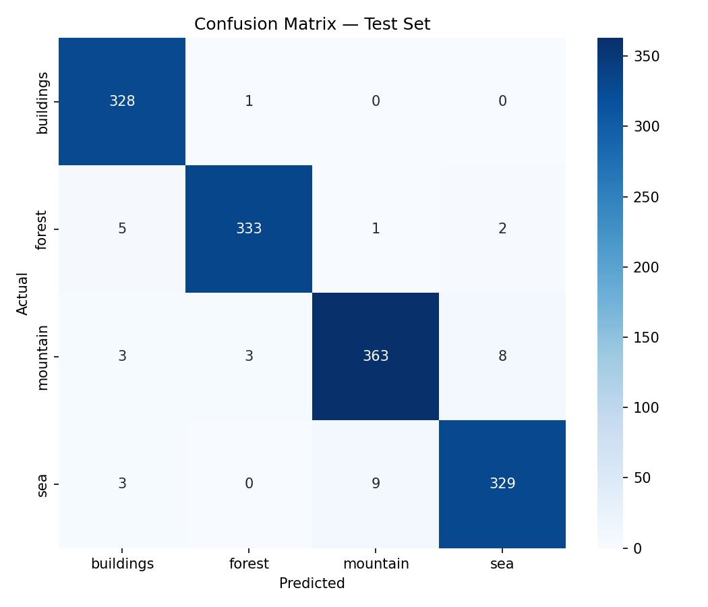

# Intel Image Classification 4-Class Scene Recognition

A deep learning project that classifies natural scene images into four categories (buildings, forest, mountain, sea) using transfer learning with EfficientNetB0. Trained on the [Intel Image Classification dataset](https://www.kaggle.com/datasets/puneet6060/intel-image-classification) from Kaggle. Final test accuracy: **98%**.



## Project Structure

```text
intel-image-4class/
  intel-image-4class.ipynb  # Main Jupyter notebook (EDA, training, evaluation, export)
  requirements.txt          # Python dependencies
  .gitignore                # Git ignore rules
  README.md                 # Project documentation
  models/
    best_model.keras        # Best checkpoint (val_accuracy)
    saved_model/            # TensorFlow SavedModel format
    tflite/
      model.tflite          # Quantized TFLite model (~5.8 MB)
      label.txt             # Class labels
    tfjs_model/             # TensorFlow.js graph model
  figures/                  # Saved training plots and evaluation charts
  data/                     # Dataset directory (not tracked by Git)
```

## Model Architecture

| Component | Detail |
|---|---|
| Backbone | EfficientNetB0 (ImageNet pretrained) |
| Pooling | GlobalAveragePooling2D |
| Normalization | BatchNormalization |
| Head | Dense(256, relu) > Dropout(0.5) > Dense(4, softmax) |
| Training | 2-phase: frozen backbone, then fine-tune top 30 layers |

## Dataset

* Source: [Intel Image Classification Kaggle](https://www.kaggle.com/datasets/puneet6060/intel-image-classification)
* Classes: `buildings`, `forest`, `mountain`, `sea`
* Total images used: ~9,248 (from `seg_train` split)
* Split: 70% train / 15% validation / 15% test (stratified)



## Results



| Metric | Score |
|---|---|
| Test Accuracy | 98% |
| Macro F1 | 0.98 |
| Buildings | Precision 0.99 / Recall 0.99 |
| Forest | Precision 0.99 / Recall 0.98 |
| Mountain | Precision 0.97 / Recall 0.97 |
| Sea | Precision 0.96 / Recall 0.97 |



## Setup

```bash
# 1. Clone the repository
git clone https://github.com/Devaaldo/intel-image-4class.git
cd intel-image-4class

# 2. Install dependencies (Using uv or pip)
uv pip install -r requirements.txt

# 3. Add your Kaggle credentials
cp kaggle.json ~/.kaggle/kaggle.json
chmod 600 ~/.kaggle/kaggle.json

# 4. Open and run the notebook
jupyter notebook intel-image-4class.ipynb
```

> The notebook will automatically download and extract the dataset on first run. To skip re-training, run the "Reload Model" cell which loads from `models/best_model.keras`.

## Export Formats

| Format | Path | Use Case |
|---|---|---|
| Keras checkpoint | `models/best_model.keras` | Further training or evaluation |
| TensorFlow SavedModel | `models/saved_model/` | TF Serving or TFLite conversion |
| TFLite (quantized) | `models/tflite/model.tflite` | Mobile or edge deployment |
| TensorFlow.js | `models/tfjs_model/` | Browser or Node.js inference |